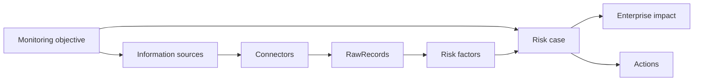

# Risk Digital Twin — From workshop to live use

**Working presentation** (extend for demo / leave-behind)  
**Audience:** Markus (innovation lead) + risk / programme stakeholders  
**Companion:** live app demo + `DEMO_SCRIPT_13_Aug.md`

---

## How to use this deck

- **Slides 1–8** — tell with the live demo (story + value).  
- **Slides 9–14** — only if they ask “how does it work / how do we go live?”  
- **Slides 15–16** — close and next steps.  
- Replace `[ ]` items with your dates, names, and logos later.

---

# PART A — Why this exists

---

## Slide 1 — Title

**Risk Digital Twin**  
Enterprise Risk Intelligence  

*From external risks on the board → live watching → yard impact → action*

Demo / discussion · `[date]`  
`[Your company]` × `[Customer]`

**Speaker note:** Don’t open with architecture. Open with their workshop language.

---

## Slide 2 — Agenda

1. What you asked for (workshop)  
2. What the twin is (and is not)  
3. Live walkthrough (overview → case → sources)  
4. How value is created (model + data)  
5. Path to real use — **you** and **us**  
6. Beyond a signalling system  
7. Proposed pilot & next steps  

---

## Slide 3 — What you asked for

Workshop: **Ulkoiset riskit** (external risks)

You mapped themes that hit the business:

- China / politics / regulation  
- Materials & energy  
- Transport Asia–EU  
- Supplier availability  
- Demand / commercial  
- Workforce · weather · …

And you already saw the chain:

**Outside world → suppliers → yard**

You wanted to **see the landscape**, then **drill into detail** — not another static register.

---

## Slide 4 — What “good” looks like in the room

**Success today:**  
You recognise *your* board in the product — and believe the twin can turn that into **live watching + drill-down + action**.

**Not success:**  
A science project, a news feed, or an IT connector catalogue with no risk story.

---

# PART B — What we show

---

## Slide 5 — Two doors, one model

| Role | Door | Job |
|------|------|-----|
| Exec / innovator / risk follower | **Risk overview** | Where is risk? Drill in. |
| Risk manager / admin | **Configure sources** | What do we watch? Connect evidence. |

Same **monitoring objectives** underneath.  
Demo starts on **overview**, not on configuration.

---

## Slide 6 — Live path (demo cue card)

1. **Risk overview** — portfolio of watch areas (your themes)  
2. **Objective → risk cases** — named situations under one watch  
3. **Risk case** — what / why / how it spreads / what to do  
4. **Live evidence** — real connector data raises **confidence** and can tick **score**  
5. **Configure sources** — how watching is attached (short proof)

**Hero story:** External signal → supplier pressure → yard impact → recommended action  

**Optional second beat:** Weather + Open-Meteo — always-on live data (no crisis required).

---

## Slide 7 — What is real today vs illustrative

| Real / working | Still illustrative / early |
|----------------|----------------------------|
| Monitoring objectives | Full enterprise scoring science |
| Source onboarding (RSS / REST) | Every source type (SAP, bulk, OAuth…) |
| Raw evidence collection | AI that invents new official risks alone |
| Case narrative + cascade picture | Closed-loop action tracking in ERP |
| Live-backed factors + confidence/score tick when evidence matches | Guaranteed “black swan” on demo day |

**Honesty builds trust.** We label baseline vs live.

---

## Slide 8 — What the twin is (and is not)

**Is:** Early-warning / signalling digital twin of external → enterprise risk  
**Is:** Shared language + evidence pack for decisions  
**Is not:** Autopilot procurement or replacement for human judgment  
**Is not:** Only a dashboard of headlines  

---

# PART C — Model (keep short in the room)

---

## Slide 9 — Conceptual model (one picture)

```text
Monitoring objective     “What are we watching?”
        │
        ├── Information sources + connectors     “How do we collect?”
        │         └── RawRecords                 “Evidence”
        │
        └── Risk cases                           “What is going on?”
                  ├── Risk factors (+ confidence)
                  ├── Linked risks
                  ├── Enterprise impact (yard)
                  └── Recommended actions
```

**One sentence:** Sources feed evidence; the twin interprets into risk cases that show how impact reaches the yard.

---

## Slide 10 — Data model (simplified)

*Use if they ask “what sits under the UI?” — one slide only.*

| Concept | Meaning |
|---------|---------|
| **MonitoringObjective** | Watch area (e.g. Geopolitical, Weather) |
| **InformationSource** | Named feeder (YLE, Open-Meteo, ERP extract…) |
| **ConnectorSpecification / Definition** | How we connect (method, endpoint, poll, profile) |
| **RawRecord** | Collected evidence item |
| **RiskCase** | A concrete risk situation under an objective |
| **RiskFactor** | Driver under the case (illustrative → live-backed) |
| **Action** | Recommended response |

**Flow:** Source → Connector → RawRecord → (filter / match) → Factor & Case posture → Overview score  

*Detail lives in architecture docs (ontology + connector architecture); don’t deep-dive unless asked.*

---

## Slide 11 — Optional diagram (for appendix or deep-dive)



---

# PART D — Path to real use

---

## Slide 12 — To go live: what **you** do

1. **Own the watch model** — confirm objectives, risk definitions, owners  
2. **Select real sources** — external *and* internal (internal often unlocks value)  
3. **Clear access** — APIs, licenses, credentials, IT / legal approval  
4. **Define actions** — who is notified, what decision, what “closed” means  
5. **Run a rhythm** — weekly review; escalate on threshold; retune quarterly  
6. **Govern trust** — who approves sources; illustrative vs live; audit trail  

---

## Slide 13 — To go live: what **we** build / harden

| Workstream | Outcome |
|------------|---------|
| Connector platform | Reliable collect; clear open / key / bulk / enterprise APIs |
| Relevance & scoring | Profiles → factors → confidence & score that move for real |
| Case lifecycle | Promote emerging signals into managed factors / cases |
| Internal data path | First yard/supplier feed (file or API) |
| Actions & feedback | Assign, status, false-alarm learning |
| Notifications | Teams/email on threshold |
| Roles & security | Exec vs risk manager vs admin |
| Operations | Keys, failed polls, retention, environments |

---

## Slide 14 — Beyond signalling — what else you get

1. **Shared risk language** across workshop and daily work  
2. **Evidence pack** for steering (source → factor → cascade → action)  
3. **Change detector** — adding a source visibly changes confidence/posture  
4. **Bridge to process** — export / link into existing risk registers (don’t rip-replace)  
5. **Learning loop** — dismissals and outcomes improve what matters *here*  

Still signalling at the core — made **decision-ready**.

---

## Slide 15 — Suggested pilot (phased)

**Phase A — Pilot (1–2 objectives)**  
e.g. Geopolitical + Weather  
You: owners + 2–3 real sources each (ideally one internal).  
Us: stable connectors, live-backed factors, notify.

**Phase B — Yard impact**  
Supplier / delivery signal + action tracking.

**Phase C — Scale**  
More objectives, bulk/sanctions, ERP-grade APIs, richer AI drafting.

---

## Slide 16 — Ask / next steps

**Today’s ask**

- [ ] Confirm pilot objectives  
- [ ] Nominate owners  
- [ ] Shortlist 3–5 candidate sources (incl. one internal)  
- [ ] Agree success metric for 8–12 weeks  

**Success metric examples**

- Time from external signal → owner awareness  
- % of elevated cases with live-backed evidence  
- Decisions taken with twin evidence pack  
- False-alarm rate trending down  

**Close line:**  
*We start as an early-warning twin: you choose what to watch and plug in real sources; we turn that into live confidence and risk cases with a supplier→yard story — then you decide, and we learn whether the signal was useful.*

---

# PART E — Appendix (extend later)

---

## A1 — What else belongs in this presentation?

| Topic | When to add |
|-------|-------------|
| **Data model** (slides 9–11) | If architects / IT join |
| **Security & data residency** | If InfoSec joins |
| **Integration map** (ERP, Teams, GRC tools) | If IT / process owners join |
| **RACI** (who configures vs who acts) | Pilot kickoff |
| **Cost / commercial** | Separate conversation |
| **Detailed ontology** | Architecture workshop, not exec demo |
| **Demo script click path** | Separate operator sheet (`DEMO_SCRIPT_13_Aug.md`) |
| **Before/after screenshots** | After live delta is stable on Weather / Geopolitical |

---

## A2 — FAQ (short answers)

**“Will it always catch China news live in a meeting?”**  
No. We don’t depend on a crisis in the room. We show **confidence rising** when real sources collect; severity rises when thresholds or matching themes hit.

**“Is this replacing our risk register?”**  
No. It feeds and explains; register / ERP stay systems of record until you choose deeper integration.

**“Who maintains connectors?”**  
Platform + light IT for credentials; risk owners maintain *what* to watch, not feed URLs.

**“How is AI used?”**  
To propose connectors and later to draft interpretation — humans approve sources and act on risk.

---

## A3 — Slide checklist before you present

- [ ] Live app: overview + one Geopolitical case + one Weather case with Open-Meteo In use  
- [ ] Know which scores are baseline vs live-bumped  
- [ ] Configure sources bookmarked but not the opener  
- [ ] One internal-source example ready as “Phase B discussion” (even if not connected yet)  
- [ ] Leave-behind: this deck + pilot ask (slide 16)

---

*Document status: working draft for extension · align wording with live product before 13 Aug.*
